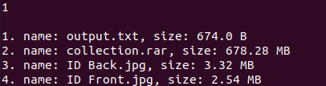
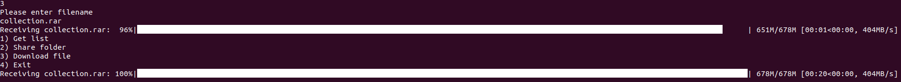

# P2PService
**P2P Service** -
[peer-to-peer](https://en.wikipedia.org/wiki/Peer-to-peer)
file sharing system with a centralized server that connects 
different clients using sockets.    

## Table of Contents

- [Functionality](#Functionality)
- [Prerequisites](#Prerequisites)
- [Installation](#Installation)
- [Running](#Running)

## Functionality
 - After connecting to the server, client will be able to choose from 
the given options


1. **Get list** - view files that are available to download from other 
clients. Given list will display file name and its size



2. **Share folder** - provide a path from which other client can download
files


3. **Download file** - provided file name that you want to download



4. **Exit** - exit the service

## Prerequisites

- [Python3.8](https://www.python.org/downloads/release/python-385/) - Python is an interpreted, high-level and general-purpose programming language.
> You can use any version of python, as long as it is **3.8+**

## Installation

```pip install -r requirements.txt```

```cp .env.example .env```

and edit *.env* file, by using your configuration

## Running

To run server

```python server/server.py```

To run client

```python client/client.py```

> Client needs server to run, since to share files
> client requires data that stored in database.