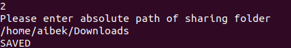

# P2PService
**P2P Service** -
[peer-to-peer](https://en.wikipedia.org/wiki/Peer-to-peer)
file sharing system with a centralized server that connects 
different clients using sockets.    

## How It Works

### Server side

1. Server runs on port that specified in *.env* file.

2. Server accepts connections from different clients and stores information about them in sqlite3 database.

3. When client leaves, information him is removed from database.

### Client side

1. Port is randomly generated during connection to server.

2. Listening port is randomly generated and used to listen to other clients for peer-to-peer file sharing.

3. When user specifies sharing folder, names of all files sent to server for future use.

4. When client wants to download file, firstly, he will get information about holder specified file and then connects to file holder for download purpose.


## Table of Contents

- [Functionality](#Functionality)
- [Prerequisites](#Prerequisites)
- [Installation](#Installation)
- [Running](#Running)

## Functionality
 - After connecting to the server, client will be able to choose from 
the given options


1. **Get list** - view files that are available to download from other 
clients. Given list will display file name and its size


2. **Share folder** - provide a path from which other client can download
files



3. **Download file** - provide file name that you want to download


4. **Exit** - exit the service

## Prerequisites

- [Python3.8](https://www.python.org/downloads/release/python-385/) - Python is an interpreted, high-level and general-purpose programming language.
> You can use any version of python, as long as it is **3.8+**

## Installation
Install packages

```
pip install -r requirements.txt
```

Make copy of .env.example and save as *.env*

```
cp .env.example .env
```

and edit *.env* file, by using your configuration

## Running

To run server

```
python server/server.py
```

To run client

```
python client/client.py
```

> Client needs server to be running, since to share files
> service requires data that stored in database.
